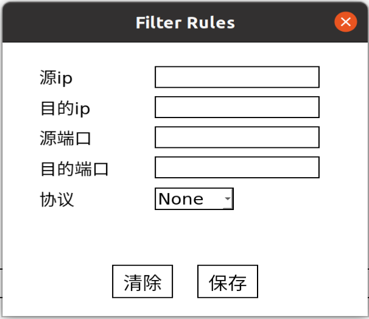

## 目录

#### [0x00  项目介绍](#0x00-项目介绍)

- [软件介绍](#软件介绍)

- [环境说明](#环境说明)

#### [0x01  实验原理](#0x01-实验原理)

- [抓包原理](#抓包原理)
- [使用libpcap库（C语言下）](#使用libpcap库（C语言下）)
  - [1. 寻找可用的网卡设备](#1. 寻找可用的网卡设备)
  - [2. 打开网卡设备](#2. 打开网卡设备)
  - [3. 设置过滤规则](#3. 设置过滤规则)
  - [4. 进行嗅探](#4. 进行嗅探)
- [网络协议报文分析](#网络协议报文分析)
  - [A. 以太网](#A.-以太网)
  - [B. ARP协议](#B.-ARP协议)
  - [C. IP协议（IPv4）](#C.-IP协议（IPv4）)
  - [D. ICMP协议](#D.-ICMP协议)
  - [E. TCP协议](#E.-TCP协议)
  - [F. UDP协议](#F.-UDP协议)

#### [0x02  实现说明](#0x02-实现说明)

- [1. 核心部分](#1. 核心部分)
  - [Sniffer类](#Sniffer类)
  - [Filter类](#Filter类)
- [2. GUI和交互部分](#2. GUI和交互部分)
  - [A. 主界面MainWindow](#A.-主界面MainWindow)
  - [B. 规则界面Dialog](#B.-规则界面Dialog)
  - [C. 进程追踪界面ProcessDialog](#C.-进程追踪界面ProcessDialog)
  - [D. 抓包调用流程](#D.-抓包调用流程)
- [3. 实现中遇到的一些问题](#3. 实现中遇到的一些问题)
  - [(1) 无法分配足够内存给内核过滤器](#(1)-无法分配足够内存给内核过滤器)
  - [(2) 抓到的包无法实时更新](#(2)-抓到的包无法实时更新)
  - [(3) 如何获得报文头的数据](#(3)-如何获得报文头的数据)
  - [(4) 如何过滤不同协议的报文](#(4)-如何过滤不同协议的报文)
  - [(5) 如何在程序中执行shell命令并获取输出](#(5)-如何在程序中执行shell命令并获取输出)
  

#### [0x03  功能展示](#0x03-功能展示)

## 0x00 项目介绍

### 软件介绍

该软件是一个网络嗅探器，可以侦听特定IP地址、特定端口的网络流量，并且对以太网、IP、ARP、ICMP、TCP、UDP、HTTP协议的数据包有分析功能，并且展示数据包的内容。此外，软件还支持查看进程的TCP连接，并侦听这些连接的流量。

### 环境说明

本实验在Ubuntu虚拟机下进行，实验环境如下：

- Ubuntu 20.04.4 LTS
- Linux version 5.13.0-39-generic
- gcc version 9.4.0
- QT 5.12.12


## 0x01 实验原理

### 抓包原理

项目使用libpcap库来侦听网络流量（抓包），其抓包原理如下图。


libpcap在数据链路层加了一个旁路，当网卡接收一个数据包时，libpcap利用已经创建的socket从链路层的驱动程序中获得该数据包的一份拷贝，并且将这份拷贝发送到BPF过滤器，过滤器根据用户编程设定的过滤规则决定是否接受该数据包，并传给相关的应用程序。

libpcap在数据链路层增加旁路处理的机制，并不干扰系统自身的网络协议栈对数据包的处理，Linux对收到的数据包，仍按照正常方式交给协议栈进行处理，再传给应用程序。lipcap捕获的只是这些数据包的拷贝。

### 使用libpcap库（C语言下）

#### 1. 寻找可用的网卡设备

```cpp
int pcap_findalldevs(pcap_if_t **alldevsp, char *errbuf);
```

`pcap_findalldevs`用于获得libpcap库可以使用的网卡设备链表，一般链表的第一个设备就是我们的网卡设备。

- `alldevsp`：返回的设备链表
- `errbuf`：错误信息

#### 2. 打开网卡设备

```cpp
pcap_t *pcap_open_live(char *device, int snaplen, int promisc, int to_ms, char *ebuf)
```

`pcap_open_live`用于打开指定的网卡设备，创建一个侦听会话。

- `device`：要打开的设备
- `snaplen`：侦听会话能够捕获的最大数据量，libpcap官网的教程将其设置为`BUFSIZE`，即8192，本项目使用的也是这个值
- `promisc`：为`true`时，打开混杂模式
- `to_ms`：将数据从内核空间复制到用户空间前，等待的时间，单位为毫秒。从内核空间切换到用户空间需要较大的开销，该参数的值越低（>0时），性能消耗越大（设想每来一份数据，就马上将其复制到用户空间，这样复制次数多了，切换开销也增加）。如果是0，会等到有足够的数据，才复制到用户态。libpcap官网的教程将其设置为`1000`，本项目使用的也是这个值

#### 3. 设置过滤规则

libpcap使用BPF filter对捕获到的数据包进行过滤。

```cpp
int pcap_compile(pcap_t *p, struct bpf_program *fp, char *str, int optimize, bpf_u_int32 netmask)
```

`pcap_compile`将bpf过滤表达式编译成bpf程序。

- `p`：`pcap_open_live`打开并返回的侦听会话
- `fp`：返回的编译好的bpf程序
- `str`：bpf过滤表达式
- `optimize`：是否对过滤表达式进行优化，推荐值为`1`，即进行优化
- `netmask`：网络的掩码

```cpp
int pcap_setfilter(pcap_t *p, struct bpf_program *fp)
```

`pcap_setfilter`将编译好的bpf过滤程序应用到侦听会话中。

- `p`：`pcap_open_live`打开并返回的侦听会话
- `fp`：`pcap_compile`编译好的bpf程序

#### 4. 进行嗅探

```cpp
int pcap_loop(pcap_t *p, int cnt, pcap_handler callback, u_char *user)
```

`pcap_loop`用于捕获数据包，并对捕获到的数据包进行处理。注意这里的数据包已经经过BPF过滤器的过滤。

- `p`：`pcap_open_live`打开并返回的侦听会话
- `cnt`：捕获的数据包的数量
- `call_back`：对每个数据包进行处理的函数
- `user`：要传递给`call_back`的一些参数

```cpp
void got_packet(u_char *args, const struct pcap_pkthdr *header, const u_char *packet);
```

`got_packet`对捕获到的每个数据包进行处理，用户可以自行编写该函数。

- `args`：`pcap_loop`中的`user`参数
- `header`：包含数据包的一些信息，时间戳，长度
- `packet`：数据包

### 网络协议报文分析

#### A. 以太网

以太网是数据链路层的协议，以太网帧的格式如下：


因为libpcap捕获到的是数据链路层的帧，因此我们要从捕获到的以太网帧开始进行解析。

- 目的地址：6字节，接收端设备的MAC地址
- 源地址：6字节，发送端设备的MAC地址
- 类型：上层协议的类型，该字段标识了数据包交付给哪个协议处理

#### B. ARP协议

ARP协议是网络层的协议，ARP报文的格式如下：


ARP报文总长度为28字节。各字段含义如下：

- 硬件类型：2字节，指出硬件接口类型，以太网的值为0x0001
- 协议类型：2字节，要映射的协议地址类型，IP协议的值为0x0800
- 硬件地址长度：1字节，硬件地址长度，单位为字节，以太网的值为0x06
- 协议地址长度：1字节，协议地址长度，单位为字节，IP地址的值为0x04
- 操作类型：表示报文的类型：ARP请求为1，ARP响应为2
- 发送方MAC地址：6字节
- 发送方IP地址：4字节
- 目标MAC地址：6字节
- 目标IP地址4：4字节

#### C. IP协议（IPv4）

IP协议是网络层的协议，IP报文格式如下：


IP报文的报头长度一般为20字节（没有选项字段），各个字段的含义如下：

- 版本号：4位，IPv4的版本值为0x4
- 首部长度：4位，单位为4字节，首部长度的范围在20B~60B
- 服务类型：1字节，一般不使用，只有使用区分服务时，这个字段才起作用
- 总长度：2字节，单位为字节，IP数据包的总长度
- 标识：2字节，用于唯一地标识主机发送的每份数据包，每产生一个数据包，标识的值就加1
- 标志：3位，第一位不使用，值为0；第二位DF表示是否允许分片，0为允许，1为不允许；第三位MF表示是否还有分片正在传输，0为没有，1为还有分片正在传输
- 片偏移：13位，单位为8字节，当报文分片后，表示该分片在原报文中的相对位置
- 生存时间：1字节，表示数据包还可经过的路由器数量，即数据包的“寿命”，若TTL为0，数据包会被丢弃
- 协议：1字节，上层协议的类型，该字段标识了数据包交付给哪个协议处理，TCP的协议号为0x06，UDP的协议号为0x11，ICMP的协议号为0x01
- 首部校验和：2字节，IP数据报文首部的校验值
- 源IP地址：4字节
- 目的IP地址：4字节
- 选项：该字段用于一些可选的报头设置，主要用于测试、调试和安全的目的。这些选项包括严格源路由（数据报必须经过指定的路由）、网际时间戳（经过每个路由器时的时间戳记录）和安全限制

#### D. ICMP协议

ICMP协议是网络层协议，ICMP报文格式如下：


ICMP报文一般为8个字节，各字段含义如下：

- 类型：1字节，表示ICMP的消息类型
- 代码：1字节，表示对类型的进一步说明
- 校验和：2字节，整个报文的校验值

#### E. TCP协议

TCP是传输层协议，TCP报文格式如下：


TCP报文的报头长度一般为20字节（没有选项字段），各字段含义：

- 源、目的端口号：2字节，用于查找发送端和接收端进程
- 序号：4字节，本报文所发送数据的第一个字节的编号
- 确认序号：4字节，接收方期望收到发送方下一个报文段的第一个字节的编号
- 首部长度：4位，单位为4字节，因此TCP的首部长度范围为20~60字节
- 标志字段：6位
  - URG：本报文中是否包含紧急数据，URG=1时，即包含紧急数据时，紧急指针字段才有效
  - ACK：确认序号字段是否有效，连接建立后，ACK=1
  - PSH：收到报文后是否立即把数据交给上层，PSH=1时，立即交给上层，而不是缓存起来
  - RST：是否重置连接。如RST=1，表示应该释放连接，重新建立连接
  - SYN：在建立连接时使用，用于同步序号，三次握手的前两次握手SYN=1
  - FIN：数据是否发送完成，FIN=1表示数据已经发送完成

- 窗口大小：4字节，表示接收方还可以接收多少字节的数据量
- 校验和：2字节，整个TCP报文的校验值
- 紧急指针：2字节，指向紧急数据的下一个字节

#### F. UDP协议

UDP是传输层协议，UDP报文的格式如下：


UDP报文的首部长度为8字节，各字段含义如下：

- 源端口号：2字节，发送端端口号
- 目的端口号：2字节，接收端端口号
- UDP长度：2字节，单位为字节，UDP报文的长度至少为8字节（数据部分为空）
- UDP校验和：2字节，整个UDP报文的校验值


## 0x02 实现说明

### 1. 核心部分

项目核心部分的工作是捕获和处理数据包，该部分工作由**Sniffer**类完成。**Filter**类负责保存过滤规则。

### Sniffer类

#### 成员变量

以下成员变量全为私有成员变量：

- **pcap_t * shandle**

  打开的libpcap侦听会话的句柄

- **pcap_if_t * dev;** 

  网卡设备

- **char errbuf[PCAP_ERRBUF_SIZE]**

  用于保存运行libpcap库时的出错信息

- **bpf_u_int32 net**

  网络设备所在网络的ip网络号

- **bpf_u_int32 mask**

  网络设备所在网络的掩码

- **int promisc_flag**

  是否启用混杂模式，`1`为启用，`0`为不起用

- **int capture_num**

  一次抓包的数量

- **QString filter_exp**

  BPF过滤表达式

- **struct bpf_program fp**

  编译后的BPF程序数据

#### 主要成员函数

1. **init**

   ```cpp
   void init(int cap_num, bool prom_flag)
   ```

   设置`capture_num`每次抓包数量和`promisc_flag`，决定是否启用混杂模式。同时获得设备、网络号、掩码等信息。

2. **active**

   ```cpp
   int activate()
   ```

   打开pcap侦听会话，获取侦听会话句柄。

3. **set_filter**

   ```cpp
   void set_filter(QString filter_str)
   ```

   设置`filter_exp`。

4. **apply_filter**

   ```cpp
   int apply_filter()
   ```

   编译`filter_exp`，并且应用到当前侦听会话中。

5. **capture**

   ```cpp
   void capture(int cap_num, bool prom_flag, QString filter_exp)
   ```

   抓包函数，调用pcap的`pcap_loop`api。

6. **process_packet**

   ```cpp
   void process_packet(u_char * args, const struct pcap_pkthdr * header, const u_char * packet)
   ```

   作为参数传入`pcap_loop`，用于处理每个数据包的函数，是分析数据包的核心代码。在这里，数据包在每一层传递的数据都被分析出来。

   a. 该函数首先使用`handle_ethernet()`函数处理捕获的数据包，得到以太网上层协议类型；

   b. 根据以太网上层协议类型，决定使用`handle_arp()`还是`handle_ip()`处理以太网帧的payload部分

   c. 如果上层协议类型是IPv4，在使用`handle_ip()`后可以得到ip层上层的协议

   d. 根据ip层上层协议类型，决定使用`handle_tcp()`还是`handle_udp()`还是`handle_icmp`处理ip报文的payload部分

   层层分析数据帧的重点在于，识别每一层协议的报文头部分，因为报文头包含了许多重要信息，分析完当层的协议报文头，需要继续分析当层数据包的payload部分（包含了上一层的协议报文头）。

   ```cpp
   u_int16_t ether_type = handle_ethernet(packet, &ether_saddr, &ether_daddr);
   
   // handle arp packet
   if (ether_type == ETHERTYPE_ARP) {
       const struct snf_arphdr * arp_packet = (struct snf_arphdr *)(packet + ETHERNET_HEADER_LEN);
       handle_arp(arp_packet);
       return;
   }
   ```

   比如分析完数据链路层的协议以太网，得到了上层协议的类型，假如是ARP协议，ARP报文的起始地址就等于以太网帧的起始地址+以太网报头的长度。以太网报头的长度是固定的，为14字节。但是一些其他协议，比如IP、TCP协议的报头长度不是固定的，需要进行解析后才能得到。

7. **handle_ethernet**

   ```cpp
   u_int16_t handle_ethernet(const u_char * packet, QString * ether_saddr, QString * ether_daddr)
   ```

   该函数用于解析以太网帧的报头，`packet`为以太网帧的起始地址。解析出发送方的MAC地址、接收方的MAC地址和上层协议的类型。

8. **handle_ip**

   ```cpp
   int handle_ip(const struct iphdr * ip_packet, uint8_t * protocol, int * ip_len, QString * ip_saddr, QString * ip_daddr)
   ```

   该函数用于解析IP报文，`ip_packet`为IP报文的起始地址。解析出IP报头的长度、上层协议的类型、发送方的ip地址、接收方的ip地址。

9. **handle_arp**

   ```cpp
   void handle_arp(const struct snf_arphdr * arp_packet)
   ```

   该函数用于解析arp报文，`arp_packet`为ARP报文的起始地址。解析出ARP报文的硬件类型、协议类型、硬件地址长度、协议地址长度、操作类型、发送方的IP地址和MAC地址、接收方的IP地址和MAC地址。

10. **handle_icmp**

    ```cpp
    void handle_icmp(const struct icmphdr * icmp_packet)
    ```

    该函数用于解析icmp报文，`icmp_packet`是ICMP报文的起始地址。解析出ICMP报文的类型和代码字段。

11. **handle_tcp**

    ```cpp
    int handle_tcp(const struct tcphdr * tcp_packet, int * sport, int * dport)
    ```

    该函数用于解析TCP报文，`tcp_packet`是TCP报文的起始地址。解析出TCP报文头的长度、发送方的端口、接收方的端口。

12. **handle_udp**

    ```cpp
    int handle_udp(const struct udphdr * udp_packet, int * sport, int * dport)
    ```

    该函数用于解析UDP报文，`udp_packet`是UDP报文的起始地址。解析出UDP报文的长度、发送方的端口、接收方的端口。

13. **handle_payload**

    ```cpp
    void handle_payload(const u_char *payload, int len)
    ```

    该函数用来保存数据包的paylaod，即应用层的数据。

14. **get_readable_payload**

    ```cpp
    QString get_readable_payload(const QString * payload)
    ```

    该函数用来将payload转为人眼易于观看的格式。

### Filter类

Filter类保存了过滤规则，并且负责<font color=red>**将过滤规则转成BPF过滤表达式**</font>。

#### 成员变量

- **QString sip**

  发送方ip地址

- **QString dip**

  接收方ip地址

- **QString sport**

  发送方端口

- **QString dport**

  接收方端口

- **QString protocol**

  协议

#### 成员函数

1. **check**

   ```cpp
   bool check()
   ```

   查看Filter的规则是否合法，即IP地址的格式、端口的范围、协议的类型（只能为嗅探器可以分析的几种）。此外，Filter的成员变量为空字符串是合法的，这代表不对该字段应用过滤规则。

2. <font color=red>**get_filter_exp**</font>

   ```cpp
   QString get_filter_exp()
   ```

   将Filter的规则转换为libpcap可以设置的BPF表达式，规则如下：
   
   | 字段            | BPF表达式                                                    |
   | --------------- | ------------------------------------------------------------ |
   | sip             | src host [sip]                                               |
   | dip             | dst host [dip]                                               |
   | sport           | src port [sport]                                             |
   | dport           | dst port [dport]                                             |
   | protocol: IP    | ip                                                           |
   | protocol: ARP   | arp                                                          |
   | protocol: TCP   | tcp                                                          |
   | protocol: UDP   | udp                                                          |
   | protocol: HTTP  | tcp port 80 and (((ip[2:2] - ((ip[0]&0xf)<<2)) - ((tcp[12]&0xf0)>>2)) != 0) |
   | protocol: HTTPS | tcp port 443 and (((ip[2:2] - ((ip[0]&0xf)<<2)) - ((tcp[12]&0xf0)>>2)) != 0) |
   | protocol: SSH   | tcp port 22 and (((ip[2:2] - ((ip[0]&0xf)<<2)) - ((tcp[12]&0xf0)>>2)) != 0) |
   
   - []内的是字段的具体值
   - 将`Filter`各个字段得到的表达式用and连接起来即可得到最终表达式
   - 关于HTTP的表达式复杂一点
     - tcp port 80表示使用TCP协议，端口为80，即HTTP协议使用的端口
     - ip[2:2]表示的是IP报文的第三个字节到第四个字节的内容，即IP报文总长度
     - ip[0]&0xf求的是IP报文的第5位到第8位的内容，即IP的首部长度，因为这个字段的单位为4B，所以需要左移2位，即x4，得到IP首部长度单位为字节
     - tcp[12]&0xf0表示的是TCP的首部长度，因为TCP的首部长度只占4位，且在字节中的前4位，所以需要右移4位，又因为该字段的单位为4B，需要左移2位，因此需要将这个部分右移2位，得到TCP首部长度，单位为字节
     - 因此，((ip[2:2] - ((ip[0]&0xf)<<2)) - ((tcp[12]&0xf0)>>2)) != 0的意思就是IP报文总长度 - IP首部长度 - TCP首部长度要大于0，即应用层报文长度不能为0
   - 过滤HTTPS、SSH协议的表达式原理同上，只是端口有所不同


### 2. GUI和交互部分

嗅探器有3个主要的GUI界面，使用QT开发，分别是**主界面**、**规则界面**和**进程追踪界面**，每个界面都是一个类。

#### A. 主界面MainWindow


主界面分为上、中、下三部分。上部分是一些按钮，中间部分显示数据包的概要信息，下部分展示某个数据包的详细信息（需要点击列表选择数据包）。

#### MainWindow类成员变量：

- **Ui::MainWindow *ui**

  UI界面对象

- **Dialog * ruleDlg[3]**

  3个规则界面对象，代表了抓包的三条规则，满足三条规则任意一条的包都会被捕获。

- **ProcessDialog * process_dialog**

  进程追踪界面对象

- **QThread thread**

  用于抓包的子线程，因为抓包需要的时间较长，因此用子线程去完成该项工作，不影响主线程的运行

#### MainWindow类主要成员函数：

1. **构造函数**

   ```cpp
   MainWindow::MainWindow(QWidget *parent)
   ```

   构造函数主要完成子线程的初始化，还有信号与槽函数的绑定（槽函数就是信号发生后，进行处理的相关函数）。初始化`Sniffer`对象，并且将其移到子线程中，使得子线程可以执行对象的成员函数。

   ```cpp
   Sniffer * sniffer = new Sniffer();
   sniffer->moveToThread(&thread);
   ```

   用`connect()`函数绑定的信号与槽函数如下：

   ```cpp
   connect(&thread, &QThread::finished, sniffer, &QObject::deleteLater);
   connect(this, &MainWindow::capture_packets, sniffer, &Sniffer::capture);
   connect(sniffer, &Sniffer::finish_capture, this, &MainWindow::finish_capture);
   ```

   - 第一条语句：子线程结束时，回收sniffer对象的内存
   - 第二条语句：主界面发出capture_packets信号时，子线程执行`Sniffer`对象中的抓包函数`capture()`，`capture()`函数会用`add_packet_row()`函数将抓到的包添加到主界面的表格中
   - 第三条语句：抓包结束后，主界面可以进行某些操作，这里是为未来预留的接口，实际上现在没有做任何操作

2. **table_init**

   ```cpp
   void table_init()
   ```

   设置表格列宽，便于展示数据包信息。

3. **add_packet_row**

   ```cpp
   void add_packet_row(QString ether_saddr, QString ether_daddr, QString ip_saddr, QString ip_daddr, int sport, int dport)
   ```

   在主界面中部分增加一行数据包信息。

4. **trace_stream**

   ```cpp
   void trace_stream(Filter f)
   ```

   追踪某条进程的TCP流。`f`是该TCP流的过滤规则，包含了源ip和端口、目的ip和端口，还有协议。`trace_stream`会将`f`添加到第一条规则。并且将源ip和目的ip交换，源端口和目的端口交换，协议不变，得到的新过滤规则添加到第二条规则。即从本机到目的机器，从目的机器到本机的TCP流都会被追踪。

#### 槽函数

以下函数为MainWindow类的槽函数，在某些信号发出后才会执行。

1. **on_pushButton_clicked**

   ```cpp
   void on_pushButton_clicked()
   ```

   该函数在点击【抓包】按钮后执行。该函数获得抓包数和混杂模式开关的值，包含在`capture_packets`信号中发出，传递给`Sniffer`对象。

2. **on_tableWidget_cellClicked**

   ```cpp
   void on_tableWidget_cellClicked(int row, int column)
   ```

   该函数在点击【表格中某一行数据包】后执行。将存储起来的该数据包的信息写到主界面的下部分，同时用`Sniffer::get_readable_payload()`函数处理存储起来的数据包载荷，转换成便于人阅读的形式，然后写到主界面的下部分。

3. **on_ruleButton1_clicked、on_ruleButton2_clicked、on_ruleButton3_clicked**

   ```cpp
   void on_ruleButton1_clicked()
   void on_ruleButton2_clicked()
   void on_ruleButton3_clicked()
   ```

   这三个函数分别在点击【rule1】、【rule2】、【rule3】按钮后执行，对应弹出第一个、第二个、或第三个规则界面。同时根据用户设置的过滤规则，设置规则界面。

4. **on_pnum_input_editingFinished**

   ```cpp
   void on_pnum_input_editingFinished()
   ```

   这个函数在填写完【抓包数】，鼠标点击其他地方后执行。检查填入的内容是否为正整数，并且不能大于100。若内容为非法格式，则将【抓包数】设置为默认值`5`。

5. **on_pushButton_2_clicked**

   ```cpp
   void on_pushButton_2_clicked()
   ```

   这个函数在点击【追踪进程流】按钮后执行，弹出进程追踪界面。

6. **on_clear_button_clicked**

   ```cpp
   void on_clear_button_clicked()
   ```
   
   这个函数在点击【clear】按钮后执行，将主界面中部分的信息清空，并且将保存的数据包信息清空，释放空间。

#### B. 规则界面Dialog



规则界面共有三个，对应嗅探器可以设置的三条规则。

#### Dialog类成员变量

- **Ui::Dialog *ui**

  UI界面对象

- **Filter filter**

  规则界面保存的过滤规则对象

#### Dialog类成员函数

1. **set_rule_text**

   ```cpp
   void set_rule_text()
   ```

   将`filter`的规则写到规则界面上，假如用户之前设置过规则，重新打开规则界面就要调用此函数。

2. **get_filter_exp**

   ```cpp
   QString get_filter_exp()
   ```

   调用`filter`的`get_filter_exp()`函数，返回其过滤表达式。

3. **set_filter**

   ```cpp
   void set_filter(Filter f)
   ```

   将`filter`的值设置为`f`的值 

4. **clear_filter**

   ```cpp
   void clear_filter()
   ```

   将`filter`的值设置为空，并且将规则界面各个输入框的值设置为空。

5. **show_warning**

   ```cpp
   void show_warning(bool show)
   ```

   根据`show`的值隐藏或者展示提示信息，提示信息用于提醒用户输入的规则是否合法，或者规则是否成功保存。

#### 槽函数

以下函数为Dialog类的槽函数，在某些信号发出后才会执行。

1. **on_save_button_clicked**

   ```cpp
   void on_save_button_clicked()
   ```

   这个函数在点击【保存】按钮后执行，检查规则界面中的规则值是否合法，若合法则保存到`filter`，显示成功的提示信息；否则显示失败的提示信息。提示信息会在3秒后自动消失。

2. **on_clear_button_clicked**

   ```cpp
   void on_clear_button_clicked()
   ```

   这个函数在点击【清除】按钮后执行，调用`clear_filter()`函数。

#### C. 进程追踪界面ProcessDialog


#### ProcessDialog类成员变量

- **Ui::ProcessDialog *ui**

  UI界面对象

- **QVector\<Procinfo\> stream_infos**

  包含了进程的名字和pid，`Procinfo`的定义如下：

  ```cpp
  class Procinfo{
  public:
      int pid;
      QString proc_name;
  };
  ```

- **QVector\<Filter\> stream_filters**

  进程TCP流对应的过滤规则

#### ProcessDialog类成员函数

1. **get_stream_info**

   ```cpp
   void get_stream_info(QString pid)
   ```

   `pid`为进程名或进程id。该进程通过通过执行shell命令`ss -tnp | grep <pid>`来获得和`pid`相关的TCP流信息，并对这些信息进行处理，提取出进程名字、pid、源ip&端口、目的ip&端口，保存到`stream_infos`和`stream_filters`中。

2. **set_table**

   ```cpp
   void set_table()
   ```

   将`stream_infos`和`stream_filters`的信息以表格形式呈现出来。

3. **clear_table**

   ```cpp
   void clear_table()
   ```

   清除表格内容，清除`stream_infos`和`stream_filters`，释放空间。

#### 槽函数

以下函数为ProcessDialog类的槽函数，在某些信号发出后才会执行。

1. **on_trace_button_clicked**

   按下【追踪】按钮时执行该函数。该函数首先调用`clear_table()`清除之前的数据，再调用`get_stream_info`得到相关数据，最后调用`set_table()`呈现相关数据到表格中。

2. **on_tableWidget_cellClicked**

   点击【表格中某一行TCP流数据】后执行该函数，该函数会弹出一个窗口，询问是否要追踪此TCP流，若确定，则会设置嗅探器的第一条和第二条规则为此TCP流相关的规则，这时回到主界面点击【抓包】，便可抓到和此TCP流相关的数据包。

#### D. 抓包调用流程

- **设置规则进行抓包**
  1. 在主界面点击【rule1】（或者其他两个rule按钮），触发`on_ruleButton1_clicked()`函数，弹出规则界面
  2. 填写规则界面，点击【保存】按钮，触发`on_save_button_clicked()`函数
  3. 回到主界面，点击【抓包】按钮，发出`capture_packets()`信号，子线程执行`sniffer`对象的`capture()`槽函数对信号进行处理，调用`pcap_loop()`函数抓包，`pcap_loop()`函数调用`process_packet`对抓到的包进行处理，并且将包的信息通过`add_packet_row()`添加到主界面的表格中

- **追踪进程TCP流进行抓包**
  1. 在主界面点击【追踪进程流】按钮，触发`on_pushButton_2_clicked`函数，弹出进程追踪界面
  2. 输入要搜索的进程pid或进程名，然后点击【追踪】按钮，调用`on_trace_button_clicked()`函数，获得相关的TCP流信息并呈现在表格上
  3. 在进程追踪界面点击表格的【某一行进程TCP流】，触发`on_tableWidget_cellClicked()`函数，在弹出的窗口中选择确认，将该TCP流应用到主界面的前两条规则中
  4. 回到主界面，点击【抓包】按钮，接下来的过程同上一流程


### 3. 实现中遇到的一些问题

#### (1) 无法分配足够内存给内核过滤器

在做项目的过程中，我发现当三条规则的每个条目都填满时，解析出的表达式会很长。此时调用`pcap_compile()`函数编译表达式时，会显示以下的警告：没有办法分配那么多的内存。


经过重新查看`libpcap`的官方文档，我找到了解决的办法。只需要将`pcap_compile()`的第4个参数`optimize`设置为`1`，`pcap_compile()`函数就会对过长的过滤表达式进行一定的优化，这样就能减少过滤器需要内核分配的内存，程序就能成功执行。

#### (2) 抓到的包无法实时更新

当我的程序只有主线程一个线程时，在我点击【抓包】按钮后，程序会等到抓完所有数据包，再将它们呈现在主界面的表格中，并且在抓包的过程中，界面不会响应其他操作，这样非常不合理。后面我发现是因为QT程序只有一个主线程，主线程进行抓包的时候，由于`libpcap`抓包的api`pcap_loop`的操作不是能实时完成的，因此主线程会堵塞，等待抓包程序执行完毕，才能修改界面。想要主线程不堵塞，就要调用子线程去执行`pcap_loop`的操作，这样主线程可以不用堵塞，继续进行别的操作，抓到的包也能实时更新到界面上。

##### **抓包列表自动下滑**

此外，抓包的时候假如想看最新的包，就要鼠标一直往下滚动，比较麻烦。因此我增加了一个槽函数，每当表格内容变动的时候，表格自动滚动到最底端，这样就能看到包实时更新了。

#### (3) 如何获得报文头的数据

解析数据包中比较难的一个部分，是解析数据包的报文头部分。看了`libpcap`的官方文档和一些教程。我发现使用C语言时，可以将数据包指针转换为相应的报文头结构体的指针，这样只要找到报文的起始地址，就能直接解析出数据包报文头部的字段。在`/usr/include/net`文件夹中的`ethernet.h`头文件有着以太网帧的报文头结构体；在`/usr/include/netinet`文件夹中的`ip.h`、`tcp.h`、`udp.h`、`ip_icmp.h`头文件中分别有着IP报文头、TCP报文头、UDP报文头、ICMP报文头的结构体。但是`/usr/include/net/if_arp.h`头文件中的ARP报文头不太符合要求，因此我就自己写了一个ARP报文头的结构体，就是`sniffer.h`中的`snf_arphdr`。

##### **网路字节序和主机字节序**

得到各个协议的报文头后，还不能使用直接通过结构体指针得到报文头各个字段的值。因为网络字节序有可能和主机的字节序不同——网络字节序通常是大端，而主机字节序一般是小端。在从网络将数据读取到本机时，字节序还是大端的，在解析报文头时要对其进行转换。`/usr/include/netinet/in.h`中提供了相应的转换函数。

##### C语言结构体的位域

我们都知道，大端和小端的区别是字节序的不同，大端是高位字节在前，低位字节在后；小端是低位字节在前，高位字节在后。对于只有一个字节的数据，大端和小端的机器上存储的数据都是一致的。那么对于小于一个字节的数据呢？以IP报文头的第一个字节为例子，前4位是版本号，后4位是首部长度。假如按照结构体指针解析报文头的逻辑前四位的地址低于后四位，结构体应该这么写：

```cpp
struct iphdr {
unsigned int version:4;
unsigned int headerlen:4;
...
```

但是`ip.h`头文件中的实现却是相反的：

```cpp
struct iphdr {
unsigned int headerlen:4;
unsigned int version:4;
...
```

当时看到这我非常困扰。经过上网查找，我发现结构体中位域在内存中的布局也是和机器相关的，在小端机器中，位域的顺序是反过来的，即`headerlen`对应的是该字节的后4位，`version`对应的是字节的前4位。只有在大端机器上，位域顺序才是正常的。我感觉这样非常不直观，下次可以避免使用位域。而是用`ip[0] >> 4`计算版本号，用`ip[0] & 0x0f`计算首部长度。 

#### (4) 如何过滤不同协议的报文

查阅libpcap的官方文档，可以发现，对于一些常见的协议，使用它们的名字作为过滤表达式即可，比如`ip`、`arp`、`icmp`、`tcp`、`udp`，但是对于一些应用层的协议，如HTTP、HTTPS、SSH，libpcap就不支持直接使用名字作为过滤表达式，这时我们就要根据协议的特点来编写表达时，比如HTTP协议的表达式是：

```cpp
tcp port 80 and (((ip[2:2] - ((ip[0]&0xf)<<2)) - ((tcp[12]&0xf0)>>2)) != 0)
```

- tcp port 80表示使用TCP协议，端口为80，即HTTP协议使用的端口
- ip[2:2]表示的是IP报文的第三个字节到第四个字节的内容，即IP报文总长度
- ip[0]&0xf求的是IP报文的第5位到第8位的内容，即IP的首部长度，因为这个字段的单位为4B，所以需要左移2位，即x4，得到IP首部长度单位为字节
- tcp[12]&0xf0表示的是TCP的首部长度，因为TCP的首部长度只占4位，且在字节中的前4位，所以需要右移4位，又因为该字段的单位为4B，需要左移2位，因此需要将这个部分右移2位，得到TCP首部长度，单位为字节
- 因此，((ip[2:2] - ((ip[0]&0xf)<<2)) - ((tcp[12]&0xf0)>>2)) != 0的意思就是IP报文总长度 - IP首部长度 - TCP首部长度要大于0，即应用层报文长度不能为0

过滤HTTPS、SSH协议的表达式原理同上，只是服务端口有所不同。


#### (5) 如何在程序中执行shell命令并获取输出

为了检测进程的TCP流，需要使用linux下的`ss`命令查看套接字信息，为了更贴合我们的需求，`ss`命令需要加上以下参数：

| 参数 | 作用                               |
| ---- | ---------------------------------- |
| -p   | 查看使用套接字的进程               |
| -t   | 展示tcp套接字                      |
| -n   | 以数字形式展示端口，而不是服务名称 |

然后我们要从结果中找到和我们输入的pid或者进程名相关的结果，此时可以使用`grep`命令，于是我们的命令就变成了`ss -tnp | grep [input]`。问题在于如何在C++程序中执行该命令并获得输出。经过查阅资料得知，可以使用`popen()`函数，其创建一个管道，调用fork产生一个子进程，执行shell命令，并且返回一个文件指针，可以利用该文件指针来读取执行命令后的输出。对输出进行解析，就可以得到进程的TCP流信息。


## 0x03 功能展示

视频比图片包含了更多信息，具体功能放在演示视频中展示。这里简单介绍一下嗅探器的用法。


- 【抓包数】是指一次的抓包数量，点击【抓包】后，会抓取数量等同于抓包数那么多数据包，才停止抓取。

- 【混杂模式】按钮用于决定抓包时是否开启混杂模式。
- 【clear】按钮用于清除表格的数据。

- 【rule1】、【rule2】、【rule3】按钮用于设置过滤规则，抓包时，满足任意一条**非空规则**的数据包都会被捕获。


点击【rule1】、【rule2】或【rule3】按钮后，会弹出规则窗口，这里可以设置该条规则的过滤表达式。满足一条规则指的是该数据包的源ip&端口、目的ip&端口、协议都满足规则窗口设置的值。假如某条值设置为空，比如源ip设置为空，不对此项做过滤。按【保存】按钮可以对规则进行保存，下次打开这个窗口时规则还会在，抓包时该条规则也会起作用。按【清除】按钮可以清除规则，抓包时规则也不会再起作用。


在主界面中点击【追踪进程流】按钮后，弹出进程追踪界面，输入进程名或者pid，点击【追踪】按钮，即可看到相关进程的TCP流。点击列表中的TCP流，即可将追踪该TCP流的规则应用到规则一和规则二（发送和接收两个TCP流，所以需要两条规则），再回到主界面进行抓包即可追踪此TCP流。

